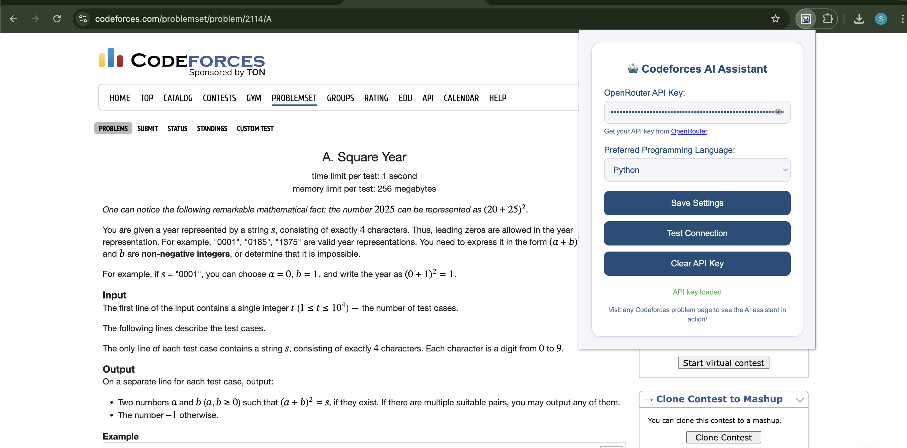
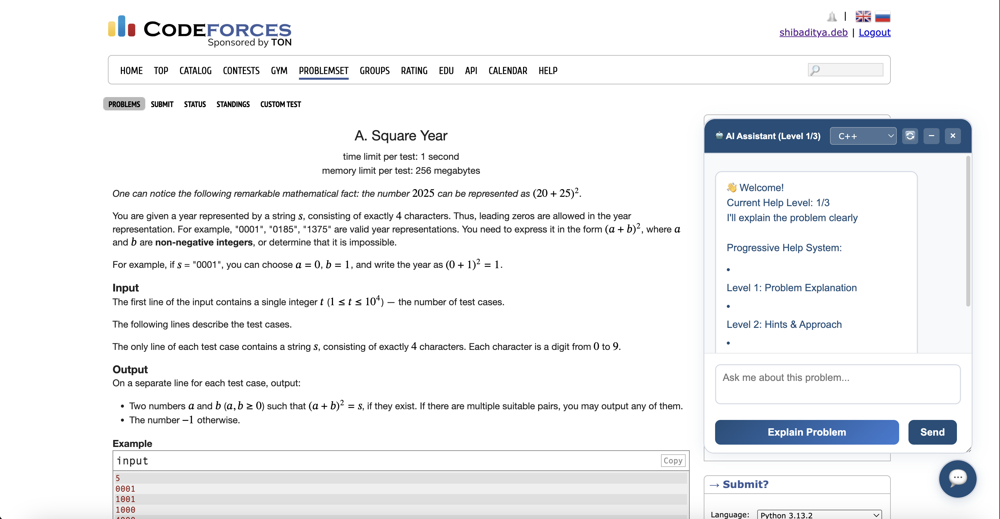
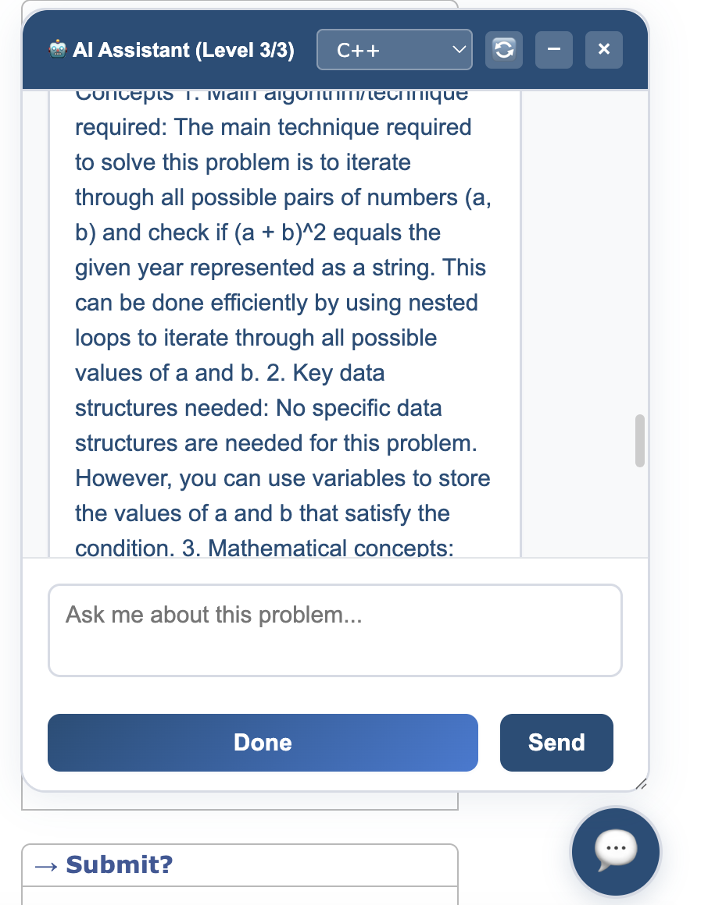

# 💡 Codeforces AI Assistant – Chrome Extension

**Codeforces AI Assistant** is a powerful Chrome Extension that enhances your competitive programming experience. Powered by **OpenRouter API (ChatGPT 3.5 Turbo)**, this tool acts as an intelligent coding companion that analyzes problems directly from your screen and provides step-by-step assistance—from understanding the problem to learning the underlying concepts.

---

## 🔍 Overview

This extension is designed to streamline problem-solving on platforms like **Codeforces** by integrating an in-browser AI chatbot. It empowers users with structured assistance through three command levels and supports user-defined prompts as well.

---

## 🚀 Key Features

- 🔐 **Secure OpenRouter API Integration**
  - API key input with real-time connection validation.
- 💬 **In-Browser AI Chatbot (ChatGPT 3.5 Turbo)**
  - Seamlessly launches once settings are configured.
- 🧠 **Intelligent Assistance with Command Levels**
  - `step1` – *Explain the problem*
  - `level2` – *Give hints*
  - `level3` – *Show concepts*
- 🛠️ **Custom Commands Support**
  - Tailor the bot’s behavior with your own prompts.
- 🖼️ **Automatic Screen Context Extraction**
  - The chatbot can take the current question from the screen to provide contextual help.

---

## 📸 Screenshots

| Popup Interface | Chatbot Launched | Response in Action |
|------------------|------------------|---------------------|
|  |  |  |

---

## 📦 Installation Instructions

### ✅ For Developers (Manual Installation)

1. **Clone the repository**
   ```bash
   git clone https://github.com/your-username/codeforces-ai-assistant-extension.git
   cd codeforces-ai-assistant-extension
